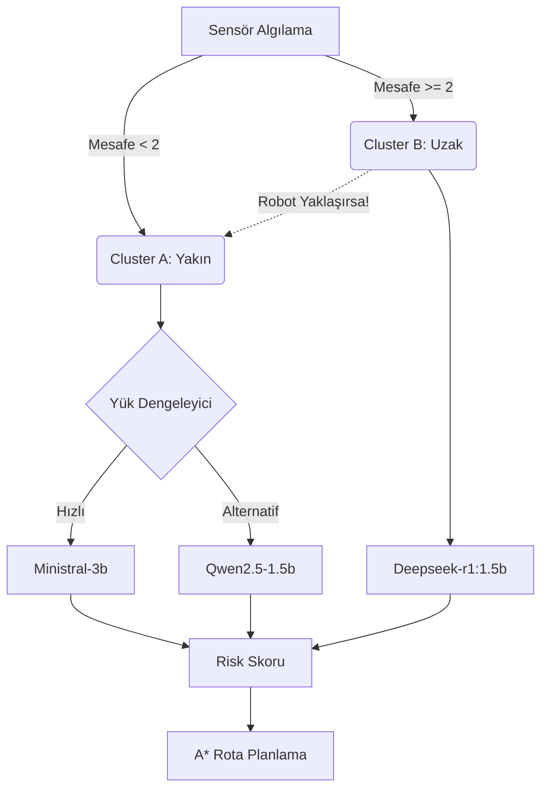

# Bilinmeyen Ortamda Otonom Robot Navigasyonu ve A* Algoritması Sunumu

## Slayt 1: Kapak
**Başlık:** Bilinmeyen Ortamda Otonom Robot Navigasyonu ve Dual-Cluster LLM Mimarisi
**Ders:** Robot Tasarımı ve Uygulamaları
**Hazırlayanlar:** [Grup Üyelerinin İsimleri]
**Tarih:** 2024-2025 Güz Dönemi

---

## Slayt 2: Projenin Amacı ve Kapsamı
**Amaç:** Başlangıçta haritası bilinmeyen dinamik bir ortamda, otonom bir robotun sensör verilerini ve Yapay Zeka (LLM) yeteneklerini kullanarak engelleri semantik olarak analiz etmesi ve hedefe giden en optimize yolu (A*) bulmasıdır.

**Kapsam:**
1. **Keşif (Exploration):** Robotun bilinmeyen bir grid haritasında ilerlemesi.
2. **Semantik Analiz:** Engellerin sadece fiziksel varlığını değil, özelliklerini (çamur, su, ateş vb.) anlamlandırma.
3. **Akıllı Karar Verme:** Hangi engelin üzerinden geçilebileceğine (risk skoru) LLM'lerin karar vermesi.

---

## Slayt 3: Gelişmiş Hibrit Mimari (Hybrid Architecture)
Projemiz, klasik algoritmaları modern üretken yapay zeka ile birleştirir:

- **Navigasyon Motoru:** **Weighted A*** (Ağırlıklı A-Star) algoritması. Riskli yollardan kaçınır ama imkansız değilse (örn: biraz çamurlu yol) ve yol çok kısaysa orayı tercih edebilir.
- **Karar Mekanizması (Brain):** Yerel olarak çalışan Çoklu-Model (Multi-Model) LLM filosu.

---

## Slayt 4: Çift Kümeli Yapay Zeka Sistemi (Dual-Cluster AI)
Performans ve güvenliği dengelemek için **iki farklı işlem kümesi** tasarlanmıştır:

### A. Cluster A (Öncelikli Küme / Priority)
* **Senaryo:** Robotun **yakın çevresindeki (< 2 blok)** engeller.
* **Davranış:** Kritik karar anı olduğu için robot **YAVAŞLAR (0.1x)**. Güvenlik önceliklidir.
* **Modeller:** `ministral-3:3b` ve `qwen2.5:1.5b`.
* **Teknoloji:** Yük dengeleyici (Load Balancer) en boş ve hızlı modeli seçer.

### B. Cluster B (Uzak Mesafe Kümesi / Background)
* **Senaryo:** Robotun **görüş menzilindeki uzak (>= 2 blok)** engeller.
* **Davranış:** Robot karar beklerken **TAM HIZDA (1.0x)** ilerlemeye devam eder.
* **Model:** `deepseek-r1:1.5b`.
* **Amaç:** İleri seviye mantık yürütme (Reasoning) ile gelecekteki rotayı önceden planlamak.

---

## Slayt 5: Dinamik Öncelik Yönetimi (Priority Upgrade)
Gerçek zamanlı bir sistemde koşullar değişebilir.

* **Durum:** Robot, Cluster B tarafından analiz edilmekte olan "uzaktaki" bir engele hızla yaklaşırsa ne olur?
* **Çözüm:** Sistem mesafeyi her karede (frame) kontrol eder. Eğer engel **2 bloktan daha yakına** girerse:
  1. Cluster B işlemi (Deepseek) arka planda iptal edilir/göz ardı edilir.
  2. Engel acil koduyla **Cluster A** kuyruğuna (Ministral/Qwen) taşınır.
  3. Robot otomatik olarak **Fren Yapar (0.1x hıza düşer)**.

---

## Slayt 6: Performans İyileştirmeleri
Simülasyonun akıcı çalışması için ek optimizasyonlar yapılmıştır:

1. **Karar Önbellekleme (Decision Caching):**
   - Robot "Ateş Çukuru"nun tehlikeli olduğunu bir kez öğrendikten sonra (Skor: 100), bir sonraki ateş çukurunda LLM'e sormaz. Hafızadan anında yanıt döner.
   
2. **Akıllı Yük Dengeleme (Load Balancing):**
   - Cluster A'daki modellerin kuyruk uzunlukları ve ortalama yanıt süreleri takip edilir. İşler en uygun modele yönlendirilir.

3. **Özelleşmiş Modeller:**
   - Hız gereken yerde `ministral`.
   - Derin mantık gereken yerde `deepseek-r1`.

---

## Slayt 7: Sistem Görselleştirmesi
*(Buraya system_design.md içerisindeki Mermaid diyagramı veya ekran görüntüsü eklenebilir)*

