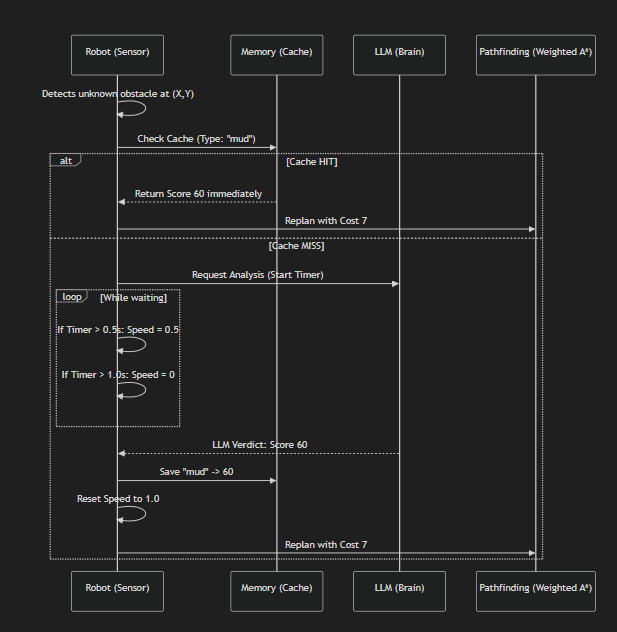

# Bilinmeyen Ortamda Otonom Robot Navigasyonu ve A* Algoritması Sunumu

## Slayt 1: Kapak
**Başlık:** Bilinmeyen Ortamda Otonom Robot Navigasyonu ve Gelişmiş A* Simülasyonu  
**Ders:** Robot Tasarımı ve Uygulamaları  
**Hazırlayanlar:** [Grup Üyelerinin İsimleri]  
**Tarih:** 2024-2025 Güz Dönemi

---

## Slayt 2: Konunun Tanımı ve Kapsamı

### Konu Nedir?
Projemizin ana konusu, **"Bilinmeyen Dinamik Ortamlarda Otonom Gezinme (Autonomous Navigation in Unknown Dynamic Environments)"** problemlerinin simülasyon ortamında incelenmesidir. Otonom bir ajanın (robot), başlangıçta haritasını bilmediği bir ızgara (grid) dünyasında, sensör verilerini kullanarak engelleri keşfetmesi ve hedefe giden en kısa yolu dinamik olarak bulmasını konu alır.

Projemizin ana konusu genel ızgara olarak elimizde bulunan haritayı kullanarak robotun sensör menzilinde ve görüş hattı içindeki engelleri keşfetmesi ve hedefe giden en kısa yolu bulmasıdır. başlangıçta hedefe giden yolu bulabilmesi için A* algoritmasını kullanmaktayız. Araç bilinmeyen engellerle karşılaştığı zaman engelin özelliklerini (aşağıda örnek bulunmakta) LLM'e gönderilmektedir. LLM verilen karara göre araç yönü belirlemektedir.

```json
{
    "type": "puddle",
    "visual": "reflective liquid surface, looks shallow",
    "physics": "liquid, low friction",
    "score": 40
}
```

### Kapsam Nasıl Tanımlanıyor?
Bu çalışma şu temel bileşenleri kapsar:
1.  **Algoritma:** **A* (A-Star)** algoritması kullanılarak robotun şartları bilinmeyen bir ortam içerisinde hedefe giden en kısa yolu bulması amaçlanmaktadır.
2.  **Algılama (Perception):** Robotun çevresini tanıması için **Görüş Hattı (Line of Sight)** ve **Menzil (Range)** kısıtlamalı sensör modellemesi oluşturduk.
3.  **Dinamik Rota Planlama:** Yeni bir engel keşfedildiğinde rotanın anlık olarak yeniden hesaplanması.
4.  **İnsan-Robot Etkileşimi:** Kullanıcı simülasyon esnasında haritaya müdahale (duvar ekleme) edebilmektedir ve robot bu müdahaleye tepki görebilmektedir.

---

## Slayt 3: Literatür Taraması ve Benzer Çalışmalar

Bu alandaki çalışmalar literatürde üç ana kategoride yoğunlaşmaktadır:

### 1. Klasik Yol Planlama (Global Planning)
Haritanın tamamen bilindiği senaryolar.
*   **Dijkstra Algoritması:** Kesin çözüm sunar ancak büyük haritalarda yavaştır.
*   **A* Algoritması (Hart et al., 1968):** Heuristic fonksiyonu ile aramayı yönlendirerek işlem yükünü azaltır. Projemizin temelini oluşturur.

### 2. Bilinmeyen Ortamlarda Keşif (Exploration & Navigation) (bunu halen planlıyoruz)
Haritanın baştan bilinmediği senaryolarda kullanılan yöntemler:
*   **D* / D* Lite (Koenig & Likhachev):** Değişen çevre koşullarında tüm yolu baştan hesaplamak yerine sadece değişen kısımları güncelleyen (Incremental Search) yöntemlerdir. Tüm haritanın sıfırdan hesaplamanın pahalı bir yöntem olmasından kaynaklı, bunun yerine daha az işlem gücünü kullanabileceğimiz bir yöntemdir.
*  **Cacheleme:** Aracın daha öncesinde karşılaştığı durumları cache içerisinde tutarak aynı durumla tekrar karşılaşması halinde LLM ile tekrar zaman kaybetmek yerine cache içerisindeki durumu kullanarak daha hızlı bir şekilde ilerleryebilir.

---

## Slayt 4: Önerilen Çalışmanın Katkıları

1. Hibrit Karar Verme Mimarisi (Hybrid Decision Making):
- **Mevcut Durum:** Geleneksel yaklaşımlar (A*, Dijkstra) engelleri sadece "geçilebilir" veya "duvar" olarak görür.
- **Katkı:** Robot, bir engelle karşılaştığında sensör verilerini (görsel, fiziksel) analiz eder ve LLM'e danışır. Eğer LLM beklenenden uzun sürede cevap verirse (>0.5s), sistem hızı kademeli olarak düşürür veya durur.

2. Semantik Engel Analizi (Semantic Obstacle Analysis):
- **Akış:** 
  1. Mesafe sensörü engeli fark eder.
  2. Robot engelin özniteliklerini (kayganlık, doku, renk) belirler.
  3. LLM, bu özniteliklere göre bir Risk Skoru (0-100) atar.
- **Dinamik Maliyet:** Risk skoru, A* algoritmasındaki hücre maliyetine (Weighted A*) dönüştürülür. Detour maliyeti riskten azsa robot başka yola sapar.

3. Karar Önbellekleme (Decision Caching):
- **Problem:** LLM sorguları zaman alıcıdır ve simülasyonun akışını bozabilir.
- **Çözüm:** Robot, analiz ettiği her engel tipini (örn: "çamur" -> Skor 60) hafızasına kaydeder. Aynı tip engelle tekrar karşılaştığında LLM'e sormadan saniyeler içinde karar verir. Bu, otonom sistemlerde gerçek zamanlı performansı maksimize eder.

---

## Slayt 5: Kaynakça (Örnek Liste - Tamamlanmalı)

Raporunuzda kullanabileceğiniz temel kaynak kategorileri şunlardır (Toplam 20 adet olacak şekilde detaylandırılmalıdır):

1.  Hart, P. E., Nilsson, N. J., & Raphael, B. (1968). "A Formal Basis for the Heuristic Determination of Minimum Cost Paths". *IEEE Transactions on Systems Science and Cybernetics*.
2.  Koenig, S., & Likhachev, M. (2002). "D* Lite". *AAAI*.
3.  Thrun, S., Burgard, W., & Fox, D. (2005). *Probabilistic Robotics*. MIT Press.
4.  Borenstein, J., & Koren, Y. (1991). "The vector field histogram-fast obstacle avoidance for mobile robots".
5.  Fox, D., Burgard, W., & Thrun, S. (1997). "The dynamic window approach to collision avoidance".
6.  *Kalan 15 kaynak için: A* optimizasyonları, Grid-based mapping teknikleri ve Robotik ders kitaplarından ilgili bölümler eklenebilir.*




--
What we have seen:
We have tried sameller models like qwen3 0.5B but what we have seen is that smaller model down't mean faster response. because when we use qwen2 1.5B it takes a lot less time to answer than qwen3 0.5B. 
So the tool calling of the model is way more important than we realised that is why we have decided that we need to go with a better tool calling model.

In many cases LLM answer can take too much time because of that we needed to take counter mesures.
First of all we are working 3 different models at the same time and we made a simple load balancer for this. This load balancer firtst looks for the queue size of each model. If the queue size is same than it will look for he time of each model. If the time is same than it will look for queues last elements time to wait we we will use lesser time model.

And also if an element from a other queue comes again we are just going to ignore it.

Models we are going to use are:
ministral-3:3b
qwen3:0.6b
qwen2.5:1.5b

or maybe qwen3 0.6b is just too slow and ministral can easly handle the load so we decided to just use ministral-3:3b and qwen2.5:1.5b 

We need to edit logs for this too and HUD