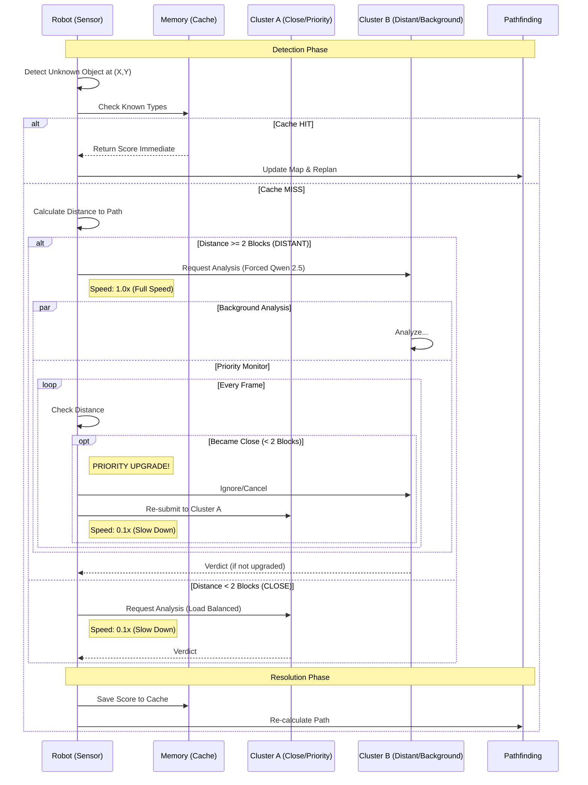

# System Visualization - Dual Cluster & Priority Upgrade

```mermaid
sequenceDiagram
    participant Robot as Robot (Sensor)
    participant Cache as Memory (Cache)
    participant ClusterA as Cluster A (Close/Priority)
    participant ClusterB as Cluster B (Distant/Background)
    participant Pathfinding

    Note over Robot, Pathfinding: Detection Phase
    Robot->>Robot: Detect Unknown Object at (X,Y)
    Robot->>Cache: Check Known Types
    
    alt Cache HIT
        Cache-->>Robot: Return Score Immediate
        Robot->>Pathfinding: Update Map & Replan
    else Cache MISS
        Robot->>Robot: Calculate Distance to Path
        
        alt Distance >= 2 Blocks (DISTANT)
            Robot->>ClusterB: Request Analysis (Forced Qwen 2.5)
            Note right of Robot: Speed: 1.0x (Full Speed)
            
            par Background Analysis
                ClusterB->>ClusterB: Analyze...
            and Priority Monitor
                loop Every Frame
                    Robot->>Robot: Check Distance
                    opt Became Close (< 2 Blocks)
                        Note right of Robot: PRIORITY UPGRADE!
                        Robot->>ClusterB: Ignore/Cancel
                        Robot->>ClusterA: Re-submit to Cluster A
                        Note right of Robot: Speed: 0.1x (Slow Down)
                    end
                end
            end
            
            ClusterB-->>Robot: Verdict (if not upgraded)
            
        else Distance < 2 Blocks (CLOSE)
            Robot->>ClusterA: Request Analysis (Load Balanced)
            Note right of Robot: Speed: 0.1x (Slow Down)
            ClusterA-->>Robot: Verdict
        end
        
        Note over Robot, Pathfinding: Resolution Phase
        Robot->>Cache: Save Score to Cache
        Robot->>Pathfinding: Re-calculate Path
    end
```
